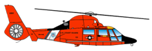

# SAR Asset Analysis 
Search and Rescue (SAR) Asset Analysis

## Abstract 

The U.S. Coast Guard (USCG) is responsible for maritime Search and Rescue (SAR) along the coast, Great Lakes, and all navigable waterways. The USCG is slowly shifting from a mixed helicopter fleet of MH-65s and MH-60s, to a consolidated single platform fleet of MH-60s due to sustainability issues with the aging MH-65s. This analysis focuses on the USCG Air Stations with helicopters located along the contiguous west coast of the U.S. and the benefits of this asset shift to residents and maritime adventurers. The analysis explores three key areas: range, response time, and the ability to remain on scene for an extended period of time (loiter time). 

## Inputs

The data for this analysis is all publicly avaiable on the web. Information about USCG SAR, helicopter capabilities, plans for the future, and the west coast air stations can all be found at [United States Coast Guard](https://www.dcms.uscg.mil/). I manually created a CSV file to capture the helicopter capabilities from the [Aviation Programs](https://www.dcms.uscg.mil/Our-Organization/Assistant-Commandant-for-Acquisitions-CG-9/Programs/Air-Programs/) page; this file is called "Aircraft" in the data folder. Air station details were utilized to create dictionaries in scripts 1 and 2 to pull air station geographic location information via an API from [Nominatim](https://nominatim.openstreetmap.org/search) and assign helicopter assets respectively. Additionally, information about helicopter fuel reserve requirements was found by referencing the [FAR/AIM](https://www.ecfr.gov/current/title-14/chapter-I/subchapter-F/part-91/subpart-B/subject-group-ECFRef6e8c57f580cfd/section-91.167).

To visualize the air station locations, population information, and follow-on analysis, I used QGIS to map multiple shapefiles from the [U.S. Census](https://www.census.gov/programs-surveys/geography/geographies/mapping-files.html). Population information was obtained via an API from the U.S. Census for 2024 and utilized the downloaded "cb_2024_us_county_500k" file (script 5). Area water mapping for the west coast was obtained via webscraping from [U.S. Census](https://www2.census.gov/geo/tiger/TIGER2025/AREAWATER/) (script 6). The "Bay Area Waterways" figure below is an example of all these layers combined in QGIS.

Manually Obtained Census Shapefiles:
* tl_2025_us_state
* tl_2025_us_county
* tl_2025_us_internationalboundary
* cb_2024_us_county_500k

**Bay Area Waterways**
 

## Python Scripts

All scripts are located in the folder "scripts" and should be run in the following order:

1. 1_locations.py

    This script is designed to pull the latitude and longitude coordinates for each USCG air station and save this information in a csv. For visualization, it reads in a map of the US from the U.S. Census and creates a geopackage of the air stations and a plot with all locations.  

2. 2_airstas.py

    This script utilizes the csv file created by script 1 and joins it with the "Aircraft" input data to create a dataframe of all air stations and their respective helicopter assets. Separate geopackages are created for past, present, and future helicopter assignments at these air stations. 

3. 3_range_rings.py

    This script utilizes the geopackages from script 2 to build out buffers for each air station and time period (past, present, future) for 3 different ranges: maximum range, response time range, and 30 min loiter range. It also allows adjustments to the amount of loiter time and fuel reserves. This script results in 6 geopackages, all located in the "output/geopackages" folder, which can be loaded in QGIS for visualizations of coverage area.

4. 4_analyze.py

    This script analyzes the geopackages from script 3 to compute the coverage area for each buffer, normalize the results to the present, and create comparison graphs (located in the "output/figures" folder). These graphs show the percent increase in area covered over time, as well as the percent of area that is covered by more than one air station, labeled as "dual cover".

5. 5_pop.py

    This script pulls population data via an API from the U.S. Census and combines it with the Census county cartographic boundaries map to create a geopackage. This population geopackage is then used in QGIS to visualize the population distribution along the west coast. 

6. 6_area_water.py

    This script conducts web scraping of the area water shapefiles from the U.S. Census for Washington, Oregon, and California. It combines these pulled files into a single area water geopackage. This is utilized in QGIS to visualize the additional maritime responsibility of the USCG inland. 

## Additional Files

The repository also includes a file called "map.qgz' (QGIS project file), which contains a visualization of all the range buffers for each time period, along with population and area water depictions. The QGIS file uses tiger line files from the U.S. Census, specifically noted in the "Inputs" section, and data generated by the Python scripts. 

There is also a folder called "images" that contains images of the MH-65 and MH-60 pictured at the top of this document, as well as images from QGIS used in the "Results" section. 

## Results

### Key Findings:
* *Maximum Range*: 26% increase in coverage area
* *Response Time Range*: 23% increase in coverage area
* *30 Min Loiter Time*: 36% increase in coverage area

### Maximum Range
The USCG's shift from a mixed fleet of MH-65s and MH-60s, to all MH-60s increases the amount of area that can be covered by 26% when accounting for maximum range capabilities. The MH-60 has a longer endurance time than MH-65s because it is larger and can carry more fuel, which increases its maximum range. The area covered by two air stations increases 20%, from 57% at present to 77% in the future.

### Response Time Range
Looking at the USCG's requirements for response time and each helicopters capabilities, the response time area coverage increased by 23% from the present to the future. The MH-60 is slightly faster than the MH-65 and its range is not as restricted by fuel. The area covered by two air stations increases by 12%, from 52% at present to 64% in the future.

### 30 Minute Loiter Range
Finally, this shift further increases the USCG's SAR capabilities supporting its capacity to search or remain on scene longer to hoist people or deploy equipment to distressed mariners. Area coverage in a 30 minute loiter scenario increases by 36% from present to the future. Additionally, the area covered by two air stations, or "dual coverage", increases by 28%, from 44% at present to 72% in the future.

### Conclusion
In conclusion, the U.S. Coast Guard's shift from a mixed helicopter fleet to a single helicopter fleet of MH-60s is very beneficial to the public. The coverage area and overlapping coverage from two air stations increases as this change occurs, increasing SAR capabilities for maritime response. 

